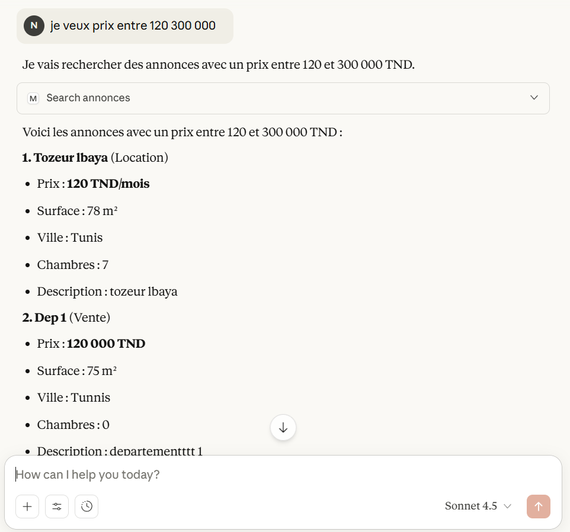
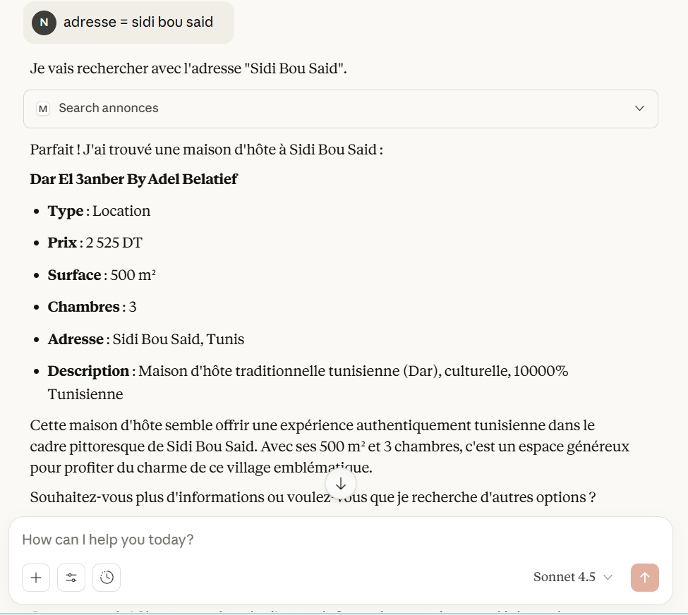
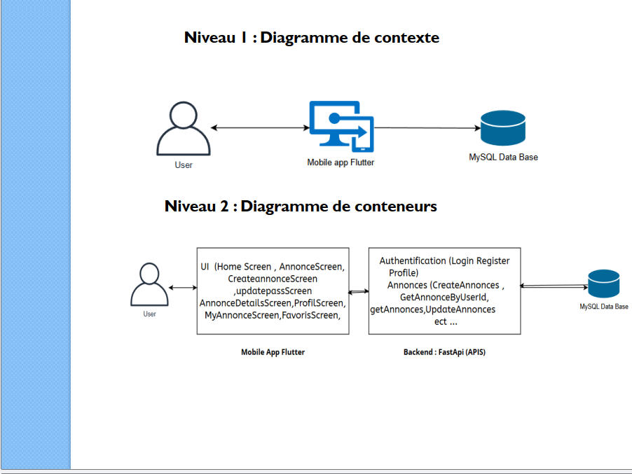
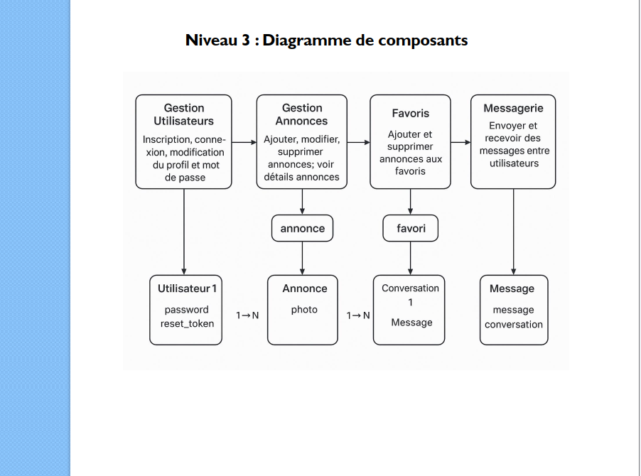

#  Home Finder App _ Flutter Version

# Présentation

Application Flutter pour trouver, lister et gérer des annonces immobiliers

# screenshots 

## Pages de list d'annonces

## Recherche d'une annonce

## Dètails d'une annonce

## Cantacter le propriètaire d'annonce 

## Ajouter une annonce

## Gérer tes propres annonces 

## Favoris 

## Messagerie 

## Conversation 

## profile

## Modifier profile

## Resset Mot de passe 

## Connexion

## Inscription

# Fonctionnalités

- Parcourir et rechercher des biens par localisation, prix ou type.

- Voir les détails d’un bien avec images, description et commodités.

- Sauvegarder des biens favoris pour un accès rapide.

- Authentification utilisateur (inscription / connexion).

- Design responsive pour appareils mobiles.

# Integration mcp service

## Recherche d'annonce prix entre 120 et 

## Recherche par type (vente ou location)

## Recherche par adresse

# Technologies

- **Flutter** - Framework UI 
- **FastAPI** - Backend  
- **Data Base** - MySQL (Xammp Local)

# C4 Model conception

# Logo 

# Installation

1. `git clone [https://github.com/Nour4git/lab2_Flutter-.git](https://github.com/FM-Home-Finder/Flutter-Final-Verison-Nour`
2. `cd immo1`
3. `flutter pub get`

# backend FastAPI repository :
1. `git clone [https://github.com/Nour4git/Mini_projet_backend_FMN]`
2. `cd backend`
3. `pip install -r requirements.txt`
4. ` uvicorn main:app --host 0.0.0.0 --port 8000 --reload`

# Mcp Server repository: 
1. `git clone [https://github.com/Nour4git/Mcp_server_home_finder]`
2. `cd mcp`
3. `pip install -r requirements.txt`
4.  `.\venv\Scripts\Activate`
5. ` python mcp_server.py`

# Run Flutter 
flutter run 

